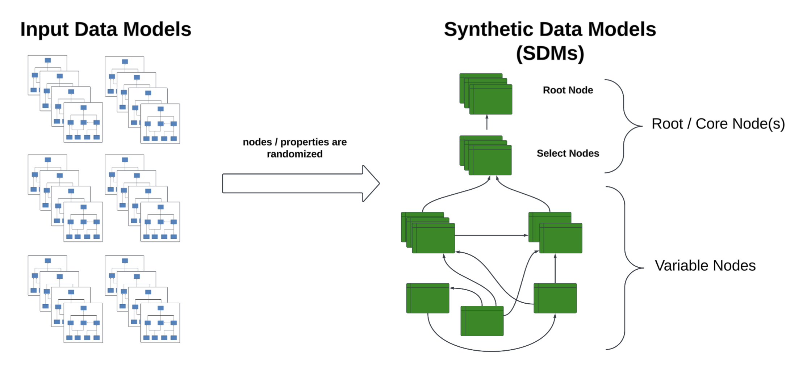
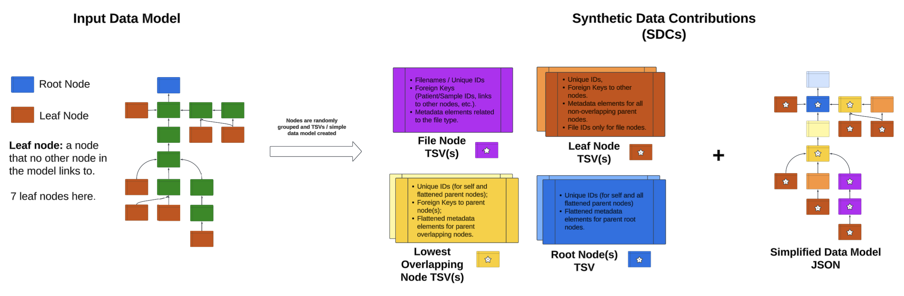

# abdi-synthetic-data-tools
This repository contains Python tools for generating AI training data for Automating Biomedical Data Ingestion and Curation (ABDI).

**Overview**: The notebooks and code in this repository can be used to generate synthetic data models based on a set of input data models and create synthetic data contributions consisting of collections of TSVs and associated simple data dictionaries for those TSVs. The purpose of generating these artifacts is to use them to train AI models to take a collection of arbitrary structured data files (TSVs) containing headers as data attributes as input and output a reasonable draft data model that both organizes and describes the data elements in a dataset and can be used to either start the process of data harmonization to an existing data model or create a new data model from scratch for a collection of structured, semi-structured and/or unstructured data files.

**Input**: Real, biomedical data models that were obtained from Gen3 data commons APIs. This repository contains 27 real, biomedical data models that have been used to curate and harmonize biomedical data across real Gen3 data commons environments that address various domains of biomedical science.

**Output**: *n* synthetic data models and a collection of synthetic data contributions based on those synthetic models. The number of contributions depends on the parameters used in the synthetic data contribution script, but essentially, subsets of nodes from each synthetic data model are chosen and then headers are grouped into TSVs using an algorithm that flattens the model below each branching point. Additionally, file manifest TSVs are created for each file node, which mimics real-world data contributions. Finally, each synthetic data contribution contains a simple, draft data model that organizes only the data elements from the TSV headers into nodes. These data models can be used to create relational or graph models or to begin to process of harmonization to an existing data model.

